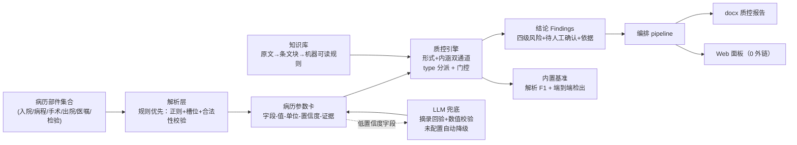

# medical-record-quality-checker

**出院病历内涵质控智能审核系统**——形式+内涵双通道质控、规范依据关联、内置可复现评测基准。规则优先，LLM 仅兜底。

> **免责声明**：本系统只做病历**书写质量与记录一致性**质控，**不是临床决策支持工具**，不提供任何诊断或治疗建议。内置数据全部为合成数据（患者身份虚构），不构成诊疗依据。

## 为什么做这个

病历质控分两层：形式质控（错别字、格式、漏项）已有成熟工具；**内涵质控**（诊断与用药一致性、手术与病程记录矛盾、检验结果自洽性等临床逻辑问题）是行业痛点——人工抽查难以发现，且直接关联医保拒赔与医疗纠纷风险。行业已有闭源 AI 质控产品落地，但**开源界没有可复现的参考实现**。本项目提供首个完整开源实现。

核心思路：六类病历部件（入院记录/病程记录/手术记录/出院记录/医嘱单/检验报告）全部解析成统一的**病历参数卡**（字段-值-单位-置信度-证据），跨文档一致性质控就归约为参数卡上的结构化比对——每条结论强制挂规范依据（文号+条款+原文摘录），无法机械判定的输出"待人工确认"。

## 特性（随里程碑推进，状态表见 [plan/00](plan/00-README总览.md)）

| 能力 | 状态 |
|---|---|
| 病历参数卡统一中间表示（schema + 契约测试） | ✅ |
| 规则引擎（type 分派 + only_if 门控；无依据规则拒绝加载） | ✅ |
| 流水线编排（节点注册/耗时记录/失败即停）+ CLI | ✅ |
| 合成病历生成器（带真值、植入缺陷、固定 seed 位级可复现） | ✅ |
| 六部件解析器 → 参数卡（解析 F1 基准 + 证据逐字摘录校验） | ✅ |
| 三层知识库（规范原文→条文块→机器可读规则 33 条全挂依据）+ 双通道规则引擎 | ✅ |
| LLM 兜底（防幻觉三件套；失败全路径自动降级纯规则通路） | ✅ |
| docx 质控报告 + Web 面板（免构建 0 外链） | ⬜ M5 |
| 脱敏审计 + 干净环境验证 + GitHub 发布 | ⬜ M6 |

## 架构



## 快速开始

要求：Python ≥ 3.8（Windows 建议用 `py` 启动器，控制台跑中文输出加 `-X utf8`）。

```bash
git clone https://github.com/yuluo554/medical-record-quality-checker.git
cd medical-record-quality-checker
pip install -e ".[dev,web,report]"   # 核心零第三方依赖；extras 为交付形态组件
pytest                               # 全离线测试（含 extras 守门）
mrqc demo                            # 架构自检演示
```

命令一览（未实现项 fail-fast 并提示实现去向）：

```bash
mrqc parse --input data/samples/xxx/   # 部件目录 → 病历参数卡 JSON
mrqc check --input data/samples/xxx/   # → 质控结论 JSON（含规范依据；LLM 已配置时先做低置信字段兜底）
mrqc run --input ... --report out.docx # 端到端 + docx 报告（M5）
mrqc benchmark parse                   # 解析 F1 基准（门槛 F1 ≥ 0.95）
mrqc benchmark detect                  # 端到端检出基准（门槛：检出率 ≥ 0.95 且干净集误报 0）
```

## 内置评测基准

基准零 API 依赖、可重复（纯规则通路 + 固定 seed 合成数据；LLM 未配置即等效基准环境，配了也不改变基准通路）。当前指标（M4 达标）：

| 基准 | 指标 | 门槛 | 当前值 |
|---|---|---|---|
| 解析 F1（`mrqc benchmark parse`） | 字段路径级微平均 P / R / F1（samples 60 份，TP=7664） | F1 ≥ 0.95 | **P = R = F1 = 1.0000** |
| 端到端检出（`mrqc benchmark detect`） | 植入缺陷主缺陷检出率（paired 54 份 = 42 缺陷 + 12 干净对照） | ≥ 0.95 | **100%（45/45）** |
| 同上 | 干净对照误报 / 期望外非 pass 结论 | 0 / 0 | **0 / 0** |
| 同上 | 非 pass 结论依据关联率（挂文号+条款+原文摘录） | — | **100%** |

口径说明：待人工确认（need_confirm）计入非 pass，计入检出；检出形式与分级在报告中显式标注（含 1 条"待核对"依据规则 F-TIME-03 以 need_confirm 形式检出）。复现：`benchmarks/parse_f1.py --min-f1 0.95`、`benchmarks/detect_paired.py`（检出首版报告见 [benchmarks/m3_detect_report.md](benchmarks/m3_detect_report.md)）。

**以上指标全部基于固定 seed 的合成病历**（3 个常见病种模板，缺陷按 14 类缺陷 ID 程序化植入），用于验证系统机械通路与规则引擎正确性；真实病历上的表现需真实标注数据验证（见"限制"）。

## 目录结构

```
├── src/mrqc/          # 解析 / 参数卡 / 规则引擎 / 知识库 / LLM 兜底 / 编排 / 报告 / Web
├── data/              # templates 病种模板 / samples 合成病历+真值 / paired 配对评测集 / knowledge 规范库
├── benchmarks/        # 解析 F1 与端到端检出基准（M2/M4）
├── tests/             # 全离线测试（含 extras 守门测试）
├── plan/              # 计划文档 00–06、决策记录、跨会话 HANDOFF
└── .github/workflows/ # CI：Python 3.8/3.10/3.12，显式安装全量 extras
```

## 路线图

| 里程碑 | 内容 | 状态 |
|---|---|---|
| M0 计划+骨架 | plan 02–06 + 可运行骨架 + CI | ✅ |
| M1 数据先行 | 3 病种模板、生成器（真值+植入缺陷）、规范原文入库 | ✅ |
| M2 解析层 | 六部件解析器 → 参数卡，解析 F1 基准出数 | ✅ |
| M3 知识与规则 | 三层知识库 + 双通道规则引擎（≥30 条，全部挂依据） | ✅ |
| M4 LLM 兜底+基准达标 | LLM 客户端（降级/防幻觉）+ F1 ≥ 0.95、干净集误报 0、指标入 README | ✅ |
| M5 编排与交付 | `mrqc run` + docx 报告 + Web 面板（0 外链断网可演示） | ⬜ |
| M6 发布 | 脱敏审计 + 干净环境验证 + GitHub 发布 | ⬜ |

## 限制

- 解析以**文本格式病历部件**为输入；打印体扫描件（OCR）为远期加分项，当前不支持；
- 知识库规则依据 5 份公开卫健委文件，条文数值逐条核对后入库（`status` 字段标注）；未核对的条目只产出"待人工确认"结论；
- 合成病历使用常见病种模板（社区获得性肺炎、急性阑尾炎、胆囊结石），疾病-用药-检验映射为公开临床常识口径，**不能替代真实临床数据验证**；
- LLM 兜底需用户自行配置 OpenAI 兼容端点（环境变量注入，密钥不入库），未配置时系统以纯规则通路运行；已配置时也只对**低置信度字段**做补抽，且逐条过防幻觉回验（摘录必须逐字来自部件原文、数值超合法性范围即丢弃），LLM 失败（超时/重试耗尽/输出损坏）自动降级，数值结论永远来自确定性规则。

## License

[MIT](LICENSE)
