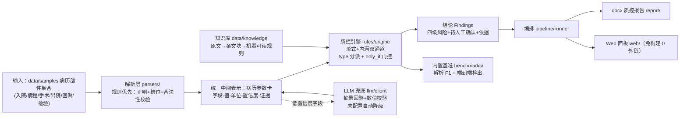

# 03 架构与技术选型

> 定稿 2026-10-03。决策记录见 [06-决策记录.md](06-决策记录.md)。

## 1. 总体架构



核心思想：**协同/比对问题归约为结构化对齐**——六类部件全部解析成同一张"病历参数卡"，跨文档一致性（诊断 vs 用药、手术 vs 术前讨论、检验 vs 病程）变成参数卡内部字段间的确定性比对，规则引擎按 type 分派、按 only_if 门控。

## 2. 目录结构（骨架已落位）

```
medical-record-quality-checker/
├── pyproject.toml            # 包名 mrqc，src 布局，核心零第三方依赖
├── src/mrqc/
│   ├── cli.py                # 子命令：demo/parse/check/run/benchmark
│   ├── models/card.py        # 病历参数卡 schema（唯一中间表示，契约文件）
│   ├── parsers/              # M2：六部件解析器（base.py 已定接口）
│   ├── rules/                # M3：Finding/Severity/依据模型 + 引擎骨架
│   ├── knowledge/            # M1/M3：三层知识库存取
│   ├── llm/                  # M4：OpenAI 兼容客户端（stdlib urllib，未配置即禁用）
│   ├── pipeline/runner.py    # M5：节点化编排（M0 已可注册执行节点+计时）
│   ├── report/               # M5：docx 导出（惰性导入 python-docx）
│   └── web/                  # M5：FastAPI 免构建面板（惰性导入，0 外链）
├── data/
│   ├── templates/            # M1：病种模板
│   ├── samples/              # M1：合成病历部件集合 + truth.json
│   ├── paired/               # M1：植入缺陷配对评测集 + defects.json
│   └── knowledge/            # raw 规范原文 / blocks 条文块 / rules 规则表
├── benchmarks/               # M2/M4：parse_f1.py、e2e_detect.py（暂占位）
├── tests/                    # 全离线，LLM 相关 mock
├── plan/                     # 本计划系列 + HANDOFF
└── .github/workflows/ci.yml  # 3.8/3.10/3.12 矩阵
```

## 3. 技术栈决策表

| 层 | 选型 | 理由 |
|---|---|---|
| 语言/版本 | Python ≥3.8（本机 3.8.8 实测） | 覆盖面广；避免 3.9+ 语法 |
| 打包 | pyproject + setuptools，src 布局，包名 `mrqc` | PEP 621 标准；src 布局杜绝测试误 import 本地目录 |
| 解析层 | 纯标准库 re + 槽位 + 合法性校验 | 规则优先；LLM 只兜底；零依赖可复现 |
| 中间表示 | dataclass 病历参数卡（`models/card.py`） | 契约清晰，dict↔dataclass 双向序列化供 Web/真值 JSON 复用 |
| 知识检索 | 纯 Python 余弦相似度（不引 faiss/numpy） | 条文块规模小（百级），够用且零依赖 |
| LLM | OpenAI 兼容 HTTP，**stdlib urllib 实现**，无独立 extra | 环境变量注入（base_url/api_key/model）；未配置自动降级规则通路；`enable_thinking=false` |
| 报告 | python-docx（extra `report`） | 惰性导入：缺依赖给安装提示，不崩 |
| Web | FastAPI + uvicorn + **python-multipart**（extra `web`） | 免构建内联单页；multipart 是上传必需依赖（姊妹项目实测教训，extras 守门测试锁定） |
| 测试 | pytest（extra `dev`） | 全离线；LLM 用 mock 注入 |
| CI | GitHub Actions：3.8/3.10/3.12 × ubuntu，装 `.[dev,web,report]` 全量 extras | 干净环境等价物；显式装全 extras 防"静默少跑" |
| License | MIT（待用户确认，见 06 待定决策 D-01） | 开源空白赛道常规选择 |

## 4. 关键设计决策

1. **参数卡是唯一契约**：解析器产出、真值生成器、规则引擎输入、Web 展示全部用 `models/card.py`。改 schema 必须同步生成器与基准（既定口径，见 HANDOFF）。
2. **规则引擎 type 分派**：check_type 枚举（required_field / timeliness / cross_consistency / medication_logic / lab_logic / signature_format / timeline_logic），引擎按 type 分派到确定性校验函数；规则本身 JSON 化（id/名称/依据/级别/门控/参数/建议模板）。
3. **门控 only_if 对全部 check_type 生效**：新增病种类目时规则带互斥门控关键词，防止跨类目误查（姊妹项目实测踩坑：conditional/checklist 分支最容易漏接）。
4. **缺陷分级**：低风险 / 一般风险 / 较大风险 / 重大风险 + **待人工确认**（多值/低置信度不硬判）。
5. **LLM 防幻觉三件套**：候选行压缩（只送含数字/关键词的行）；要求"原文编号+逐字摘录"，摘录不是原文子串即丢弃；数值合法性范围校验（超范围丢弃）。
6. **依赖分层**：核心 `pip install .` 即可跑解析+规则+基准；`[report]`/`[web]` 为交付形态 extras；extras 守门测试静态断言（覆盖运行期与测试期真实 import）。
7. **0 外链交付**：Web 单页内联 CSS/JS、报告 docx 无外部引用；`/docs`、`/redoc` 显式关闭（Swagger UI 引 CDN）。

## 5. LLM 供应商约定

- 配置全部走环境变量：`MRQC_LLM_BASE_URL` / `MRQC_LLM_API_KEY` / `MRQC_LLM_MODEL` / `MRQC_LLM_TIMEOUT`；
- 默认建议阿里云百炼 DashScope 的 OpenAI 兼容端点（qwen 系），**密钥不入库**（.gitignore 已覆盖 .env）；
- 客户端行为：未配置 → `llm_available() == False`，流水线自动走纯规则通路；配置了 → 超时/重试/失败降级规则通路；
- LLM 职责白名单：低置信度字段抽取兜底、别名归一、结论复核、报告行文。**数值结论永远来自确定性规则**。

## 6. 数据流（端到端一条命令）

```
mrqc run --input data/samples/xxx/          # 一份病历的部件集合目录
  ├─ 节点1 解析：六部件 → 参数卡（含置信度/证据）
  ├─ 节点2 LLM 兜底（可选）：低置信度字段补抽（未配置跳过）
  ├─ 节点3 质控：加载 data/knowledge/rules/*.json → 双通道检查 → Findings
  ├─ 节点4 汇总：分级统计 + 依据关联率
  └─ 节点5 导出：JSON 结果 → docx 报告（--report 时；extra report）
```
